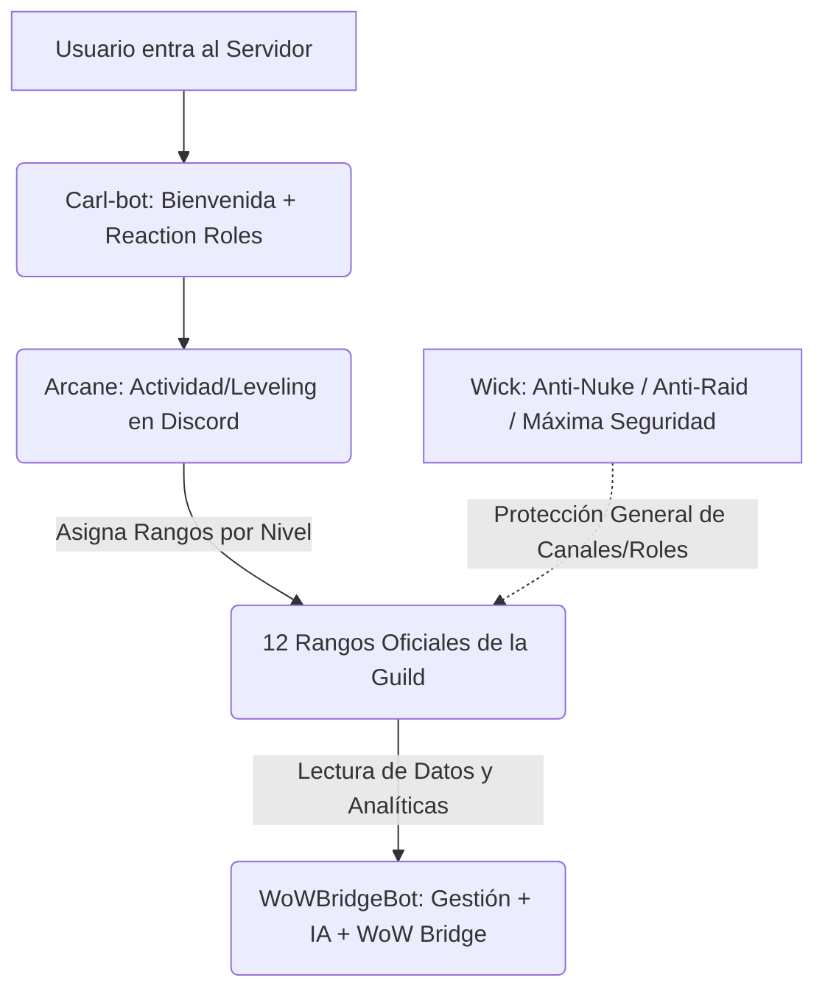

# Guía de Operación y Arquitectura Multi-Bot: Guild Management

Este documento detalla la arquitectura multi-bot de la hermandad y especifica el funcionamiento del módulo **Guild Management** en el bot WoWBridgeBot, garantizando una administración libre de fricción y con seguridad reforzada.

---

## 1. Distribución de Roles del Ecosistema Multi-Bot

Para mantener el servidor de Discord seguro, ordenado y activo, coexisten cuatro bots con responsabilidades bien delimitadas:



| Bot | Propósito | Responsabilidad Clave | Nivel de Riesgo / Permisos |
| :--- | :--- | :--- | :--- |
| **1. Wick** (Externo) | Anti-Nuke / Anti-Raid / Seguridad | Máxima autoridad de protección. Evita destrucción masiva de canales y roles. | **Crítico / Alto:** Administrador (Manage Roles, Manage Channels, Ban Members). |
| **2. Arcane** (Externo) | Leveling y Progresión Social | Registra actividad en chat y voz. Asigna automáticamente los 12 roles oficiales según niveles. | **Moderado:** Gestionar Roles, Enviar Mensajes. |
| **3. Carl-bot** (Externo) | Onboarding y Auto-Roles | Envía mensajes de bienvenida, logs del sistema y gestiona reaction roles iniciales (clase, facción, etc.). | **Moderado:** Gestionar Roles, Enviar Mensajes, Gestionar Canales (Tickets básicos). |
| **4. WoWBridgeBot** (Este bot) | Integración WoW + Analíticas + Asistente IA | Conecta el chat WoW, ofrece el panel táctil de guild y provee un motor analítico conductual asistido por IA para el Staff. | **Limitado:** Ver Canales, Enviar Mensajes, Usar Aplicaciones. *No requiere gestionar canales ni roles globales.* |

---

## 2. Guía de Permisos y Seguridad (Discord)

Para garantizar la seguridad total y que el bot de seguridad **Wick** no entre en conflicto con el bot de WoW (o viceversa), aplica la siguiente configuración de permisos en tu servidor:

*   **Wick:** Debe estar posicionado en la cima de la jerarquía de roles de Discord y contar con el permiso `Administrador` o por lo menos `Gestionar Servidor`, `Gestionar Canales`, `Gestionar Roles` y `Expulsar/Banear Miembros`.
*   **Arcane:** Debe estar posicionado por encima de los 12 roles de rango de progresión. Necesita obligatoriamente los permisos de `Gestionar Roles` (para poder asignar y remover los rangos por nivel) y `Ver Historial de Mensajes`.
*   **Carl-bot:** Requiere `Gestionar Roles` (para dar roles de clase iniciales), `Gestionar Mensajes` y `Usar Emojis Externos`.
*   **WoWBridgeBot:** **No necesita permisos de Administrador ni de Gestionar Canales.** Únicamente requiere:
    *   `Ver canales` (View Channels)
    *   `Enviar mensajes` (Send Messages)
    *   `Leer el historial de mensajes` (Read Message History)
    *   `Añadir reacciones` (Add Reactions)
    *   `Usar aplicaciones/comandos de barra` (Use Slash Commands / Application Commands)

---

## 3. Configuración de Arcane: Mapeo de Niveles a los 12 Rangos

Tú eres responsable de crear y nombrar los 12 roles en Discord de forma idéntica a como están definidos en la lista paramétrica `GUILD_RANK_ROLES` en `config.py`:

```python
GUILD_RANK_ROLES = [
    "Leyenda", "Maestro", "Oficial", "Veterano", 
    "Raider Principal", "Raider", "Raider PUG", 
    "Miembro", "Recluta", "Iniciado", "Alter", "Prueba"
]
```

### Configuración del Dashboard de Arcane (Dashboard Web):
1. Inicia sesión en el panel web de Arcane con tu cuenta de administrador de Discord.
2. Ve a la sección **Leveling** > **Role Rewards** (Recompensas de Rol).
3. Añade las recompensas para cada rol mapeándolo a tus niveles preferidos (ejemplo sugerido):
   *   `Prueba` -> Nivel 1
   *   `Alter` -> Nivel 2
   *   `Iniciado` -> Nivel 3
   *   `Recluta` -> Nivel 5
   *   `Miembro` -> Nivel 10
   *   `Raider PUG` -> Nivel 15
   *   `Raider` -> Nivel 20
   *   `Raider Principal` -> Nivel 25
   *   `Veterano` -> Nivel 35
   *   `Oficial` -> Nivel 50
   *   *(Los roles Leyenda y Maestro se asignan de forma manual y no por Arcane para mantener el control jerárquico)*.
4. **Activación de "Remove Previous Roles":** En el dashboard de Arcane, asegúrate de activar la opción **"Stacking Roles: Disabled"** (o "Remove Previous Roles"). Esto garantiza que cuando un miembro ascienda de nivel y gane el nuevo rango de la hermandad, Arcane le remueva el rango anterior automáticamente, manteniendo la lista de miembros de Discord limpia y con un solo rango oficial a la vez.

---

## 4. Guía de Operación Visual / Táctil

Este módulo prohíbe completamente los comandos de texto legados. Para interactuar con él, el staff utilizará las siguientes herramientas:

### A. El Panel `/guild-panel`
*   **Comando:** `/guild-panel` (Slash Command).
*   **Permiso:** Requiere que el usuario ejecutor tenga el permiso de Discord **Gestionar Servidor** (`manage_guild=True`).
*   **Regla de Uso:** Debe ejecutarse **exclusivamente** dentro de un canal restringido de staff (ejemplo: `#panel-oficiales` o `#staff-general`). El bot bloqueará su uso en canales públicos.
*   **Pestañas del Panel:**
    1.  `📊 Distribución de Rangos`: Lee la lista de miembros de Discord en tiempo real, filtra bots y muestra gráficos de barras con porcentajes de miembros en cada uno de los 12 rangos.
    2.  `👥 Progresión Reciente`: Muestra el log de base de datos de los últimos ascensos o reclutamientos completados en la comunidad.
    3.  `🤖 Asistencia IA Staff`: Muestra estadísticas del asistente y los últimos reportes de incidencias tomados de forma interna.

### B. Menú Contextual: "Ver ficha de miembro"
*   **Acceso:** Haz clic derecho sobre cualquier miembro en Discord -> ve a **Apps** (Aplicaciones) -> selecciona **Ver ficha de miembro**.
*   **Permiso:** Reservado a oficiales con permiso de **Gestionar Mensajes** (`manage_messages=True`).
*   **Información provista:** Envía un mensaje **efímero** (100% privado y visible únicamente para el oficial que lo invocó) con:
    *   Información de registro del usuario, ID y avatar.
    *   Rango actual estimado mapeado de 1 a 12 según sus roles actuales.
    *   Historial de incidencias y notas cargado desde la base de datos local SQLite.
    *   Botón **"Analizar con IA"**: Solicita al asistente de inteligencia artificial un diagnóstico sintético instantáneo.

### C. Evaluación y Sugerencia de Sanciones (`/ai-suggest-action`)
*   **Comando:** `/ai-suggest-action` (Slash command restrictivo para moderadores).
*   **Funcionamiento:**
    1.  Abre un modal interactivo con un cuadro de texto para redactar el reporte conductual en lenguaje natural.
    2.  Al enviar, procesa asíncronamente con la API la descripción.
    3.  Devuelve un embed privado con la sugerencia exacta de sanción y justificación (Leve, Moderada, Grave).
    4.  Incluye un botón interactivo **"Archivar en Historial de Miembro"** para guardar el incidente de forma segura en la base de datos de historial con un solo clic.

---

## 5. Política de Privacidad Administrativa (Notas de Moderación)

Para garantizar la confidencialidad de la información y la integridad de tus miembros (siguiendo directrices de seguridad avanzada):

1.  **Datos no almacenables:** Está estrictamente prohibido y bloqueado por el repositorio almacenar cualquier dato real privado del jugador (incluyendo direcciones IP, correos electrónicos, nombres reales, ubicaciones geográficas o capturas de chats privados).
2.  **Estructura de Logs Conductuales:** El bot solo archiva variables operativas de Discord:
    *   `user_id` (Identificador numérico único de Discord).
    *   `username` (Nombre del miembro en Discord).
    *   `staff_id` (ID del oficial que registró la nota).
    *   `staff_username` (Nombre del oficial que registró).
    *   `note` (La descripción literal y objetiva de la falta cometida dentro del juego o chat).
    *   `suggested_action` (La sanción recomendada por el asistente de IA).
3.  **Acceso Restringido:** Las notas de staff son inalcanzables para los miembros comunes y no se publican en ningún canal abierto. Solo son accesibles de forma efímera para el staff autorizado.
